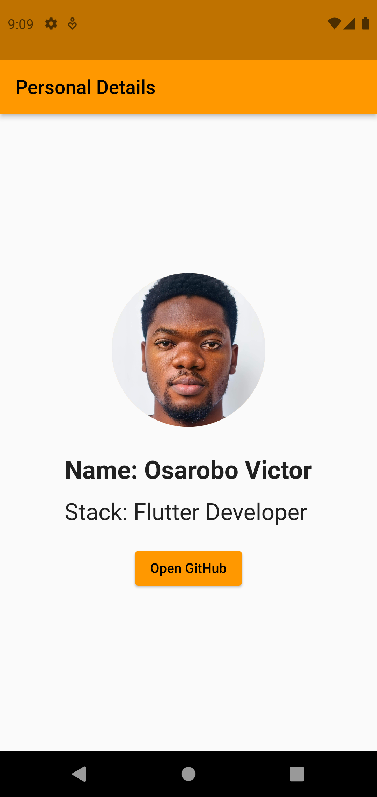
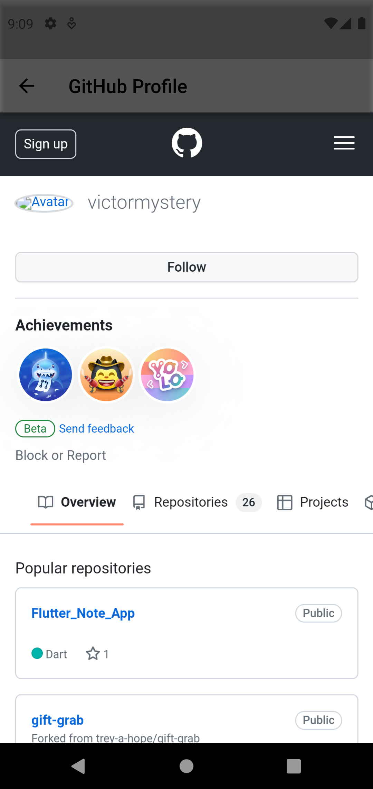

# Personal Detail Task HNG

Flutter project for display slack identity(Name and Profile Picture).

## Getting Started

Certainly! Below is a README.md file based on the provided Flutter mobile application code. This README includes instructions on how to set up the project, its features, and usage information:


# Slack & GitHub Mobile App

A Flutter mobile application that displays personal details, including a profile picture, and provides the ability to open a GitHub profile within the app using a WebView component. The app is designed to be flexible and responsive to fit various screen sizes.

## Features

- Display personal details, including name and stack.
- Show a profile picture.
- Open a GitHub profile within the app using a WebView component.
- Responsive design to fit various screen sizes.

## Screenshots




## Getting Started

Follow these instructions to get a copy of the project up and running on your local machine.

### Prerequisites

- Flutter: [Install Flutter](https://flutter.dev/docs/get-started/install)
- Dart: [Install Dart](https://dart.dev/get-dart)

### Installation

1. Clone the repository:

   ```bash
   git clone https://github.com/victormystery/hngtask_1.git
   ```

2. Navigate to the project directory:

   ```bash
   cd hngtask_1
   ```

3. Install the project dependencies:

   ```bash
   flutter pub get
   ```

### Usage

1. Open the project in your preferred Flutter development environment (e.g., Android Studio, VSCode).

2. Replace the following placeholders in `lib/main.dart` with your actual information:

   - `YOUR_NAME`
   - `YOUR_STACK`
   - `assets/vic.jpg` with your profile picture path
   - `https://github.com/victormystery` with your GitHub profile URL

3. Run the app on an emulator or physical device:

   ```bash
   flutter run
   ```

## Contributing

If you'd like to contribute to this project, please follow these guidelines:

1. Fork the repository.

2. Create a new branch for your feature or bug fix:

   ```bash
   git checkout -b feature/my-feature
   ```

3. Commit your changes and push to your forked repository:

   ```bash
   git commit -am 'Add new feature'
   git push origin feature/my-feature
   ```

4. Create a pull request against the main repository.

## License

This project is licensed under the MIT License - see the [LICENSE](LICENSE) file for details.

## Acknowledgments

- Thanks to the Flutter and Dart communities for providing excellent tools and documentation.
```

Make sure to customize the content, screenshots, and installation instructions as needed for your specific project. Additionally, update the placeholders with your actual information and URLs.